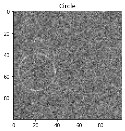
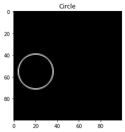
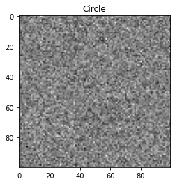
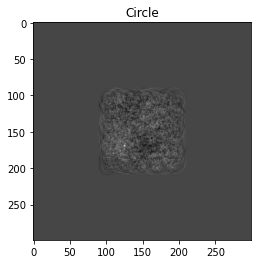
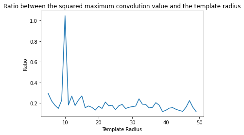
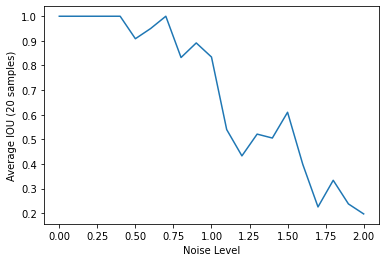
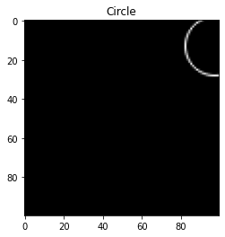
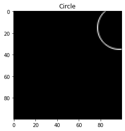
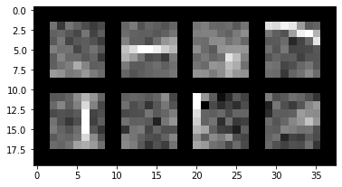

# ml-circle-detection

## Goal

Given a circle in a noisy image, detect the location and radius of the circle.

## Overview

Below is a sample of a noisy circle (left) and the ground-truth solution (right)

 

I approach this problem from two perspectives:
1. A brute force CV approach using convolutions of template filters
2. A deep learning approach using CNNs

Both approaches perform well. With a noise level of 0.5, the CV approach achieves an average iou value of 0.988 and the deep learning approach 0.884. 

The CV approach is noticeably slower at test time, but it is more reliable than the deep learning approach and requires no training.

Note: The .ipynb file is written for Google Colab

## CV Approach (convolutions of template filters)

### Idea

We can take a template circle with the correct radius and convole it over a noisy circle image. The maximal value in the convolution result should indicate the centroid of the noisy circle. This is because the sum of the points on the circle should be higher than the sum of noisy points.

### Algorithm overview

For every possible expected radius value, convolve a template circle over the noisy image. Find the maximal value in the convolution result and compute a ratio between the maximal value and the cirlce's size. 

The template circle with the highest ratio indicates the radius of the circle in the noisy image. And the location of the maximal convolution value indicates the circle's centroid.

### Sample result

Below is a sample input with 0.7 noise level (left) and the result of a convolution using the predicted radius value. Even though the circle is barely noticable in the template, there is a clear bright spot in the convolution at the circle's centroid.

  

Below is a graph which plots the ratio value agains each possible template radius. The correct radius value has the highest ratio value.

 

### Analysis

Below is a plot of average iou against noise level. This algorithm can handle very high noise (up to 1.0) before the iou values drop off.

 

With 500 samples at a noise level of 0.5, the average iou was 0.988

## Deep learning

### Idea

Instead of using a brute force approach, train a CNN to produce a circle's radius and location given a noisy image. This won't be as robust, but will be faster at test time and applicable to more complex problems.

### Training

Used a basic CNN with 3 convolution layers and 3 fully connected layers. Loss was the mean squared error of the output vector (x coordinate, y coordinate, radius).

Trained for 20,000 iterations. Model can be found at ./circle_detection_model.pth

The model was only trained on noise levels of 0.5, though with more training this can be expanded to predict for more noise levels.

### Sample result

Below is a sample output from the CNN (left) and the ground truth label (right)

  

iou: 0.5625

(This was an especially bad sample, though the result is still reasonable)

### Evaluation

On 10,000 samples, the average iou was 0.884

### Analysis

Below is a visualization the the (7x7) filters from the CNN's first layer

Some of the filters look like edge detectors. The top-right filter appears to be circular.

## Final thoughts

Overall, the CV solution using template convolutions proved to be more accurate. However, given enough training time and possibly more parameters, I believe that the CNN solution could match the performance of the CV solution.

For this exact problem, I would recommend the CV solution as long as image sizes remain small. It is accurate and inference is relatively fast. 

However, if images become too large or runtime is an important factor, the deep learning solution is best. Additionally, for similar problems where objects are not as well defined, the CV solution would not suffice. Deep learning is the better option for understanding and detecting complex objects.
